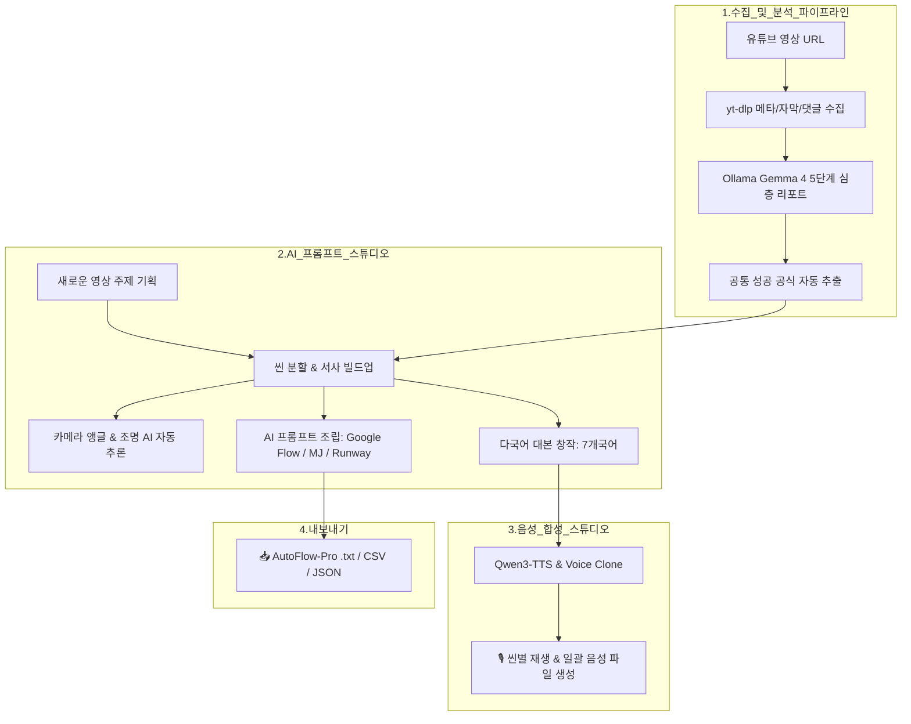

# 🎬 YouTube Video Analyzer & AI Prompt / Voice Studio

<div align="center">


<p align="center">
  <strong>유튜브 흥행 영상의 심층 메타데이터와 연출 기법을 분석하고,</strong><br>
  <strong>도출된 성공 공식을 기반으로 신규 주제의 기승전결 시네마틱 프롬프트·7개국어 대본·Qwen-TTS 음성(Voice Clone)을 원스톱으로 창작하는 멀티모달 AI 플랫폼입니다.</strong>
</p>

</div>

---

## 🌟 주요 핵심 기능 (Key Features)

### 1. 🔍 유튜브 심층 분석 (YouTube Video & Metadata Analyzer)
- **yt-dlp 기반 고속 수집**: 영상 메타데이터, 챕터 타임라인, 자막(한국어/영어), 시청자 댓글 여론 실시간 수집
- **Ollama Gemma 4 심층 5단계 전략 리포트**:
  1. 제목·훅(Hook) 구조 분석
  2. 전개 방식 (단계별 서사 구조)
  3. 핵심 메시지 및 인사이트
  4. 댓글 여론 특징 및 시청자 반응
  5. 내 채널에 바로 적용할 3가지 실행 전략

---

### 2. 🎨 AI 프롬프트 스튜디오 (AI Cinematic Prompt Studio)
- **성공 공식 자동 주입**: 분석된 영상들의 공통 강점(5초 오프닝 훅, 4단계 서사, 스케일 대비 연출, 시네마틱 조명)을 프롬프트 엔진에 자동 결합
- **카메라 앵글 & 시네마틱 조명 AI 자동 추론 (Auto-Inference)**: 씬별 분위기에 맞는 최적의 카메라 무빙(Extreme Wide, Drone 360, Dolly Zoom 등)과 조명(Volumetric Fog, Cyberpunk Neon, Chiaroscuro 등)을 스스로 판단하여 합성
- **타겟 생성 AI 모델 지원**:
  - 🎥 **Google Flow (Veo 2/3, Imagen 3/4)**: AutoFlow-Pro 최적화 서술형 프롬프트
  - 🎨 **Midjourney v6.1**: `--ar 16:9 --v 6.1 --style raw` 자동 결합
  - ⚡ **Runway Gen-3 / Kling AI / Luma**: 물리 인터랙션 & 카메라 모션 강조 프롬프트
- **초고속 생성 최적화**: 토큰 75% 절감 및 파이썬 엔진 결합으로 10~20초대 신속 생성

---

### 3. 🌐 7개국 다국어 대본 창작 (Multilingual Script Generator)
- 🇰🇷 **한국어 (Korean)**
- 🇺🇸 **English (영어)**
- 🇯🇵 **日本語 (일본어)**
- 🇨🇳 **中文 (중국어)**
- 🇫🇷 **Français (프랑스어)**
- 🇩🇪 **Deutsch (독일어)**
- 🇪🇸 **Español (스페인어)**

선택한 언어의 원어민 뉘앙스에 맞는 씬별 내레이션 대본을 자동 창작하여 글로벌 영상 기획을 완벽 지원합니다.

---

### 4. 🎙️ Qwen3-TTS & 내 목소리 학습(Voice Clone) 통합 음성 스튜디오
- **3대 핵심 엔진 통합**:
  - `CustomVoice`: 공식 성우 프리셋 (`Ryan`, `Sohee`, `Uncle Fu`, `Vivian`) + 어조/감정 제어
  - `VoiceClone (Base)`: 사용자 음성 파일 업로드 기반의 Zero-shot 본인 목소리 복제
  - `VoiceDesign`: 자연어 프롬프트 기반 가상 캐릭터 목소리 설계
- **웹 UI 오디오 플레이어 & 일괄 합성 (Batch TTS)**: 씬별 오디오 재생 및 전체 씬 일괄 생성

---

### 5. 📤 AutoFlow-Pro 및 멀티 포맷 내보내기 (Export)
- **AutoFlow-Pro `.txt`**: AutoFlow-Pro의 `[Import from .txt]` 원클릭 불러오기 호환 포맷
- **스마트 태스크 `.csv`**: 스프레드시트 및 업무 관리용 데이터셋
- **워크플로우 `.json`**: 파이프라인 연동용 표준 JSON

---

### 6. 🛡️ 제로트러스트(Zero-Trust) 보안 체계
- **개인 경로 식별자 완전 제거** 및 환경변수화 (`QWEN_PYTHON`, `QWEN_TTS_DIR`)
- **커맨드 인젝션 차단**: `os.system` 전면 제거 및 `subprocess.run` 인자 분리 적용
- **SSRF 방어**: 공식 유튜브 도메인 외 내부망 요청 차단 (`verify_youtube_url`)
- **Path Traversal 방어**: 오디오 서빙 및 업로드 경로 경계 검증 (`is_relative_to`)
- **보안 헤더 미들웨어**: `X-Content-Type-Options: nosniff`, `X-Frame-Options: DENY`, `X-XSS-Protection`
- **XSS 방어**: `escapeHtml` 컨텍스트 이스케이프 강제 적용

---

## 🏗️ 시스템 아키텍처 (Architecture)



---

## 🚀 빠른 시작 가이드 (Quick Start)

### 1. 사전 요구사항 (Prerequisites)
- **Python 3.11+**
- **FFmpeg** (`brew install ffmpeg` 또는 OS 패키지 매니저)
- **Ollama** ([https://ollama.ai](https://ollama.ai)) 및 Gemma 4 모델 로드:
  ```bash
  ollama run gemma4:latest
  ```

### 2. 저장소 클론 및 가상환경 설정
```bash
git clone https://github.com/casareborgia/youtube-video-analysis.git
cd youtube-video-analysis

python3 -m venv .venv
source .venv/bin/activate
pip install -r requirements.txt
```

### 3. 환경변수 설정 (선택 사항)
Qwen-TTS 가상환경 경로를 커스텀 지정하려면 `.env` 파일에 아래 환경변수를 등록할 수 있습니다:
```bash
# .env (선택)
QWEN_TTS_DIR=/path/to/QWEN-tts
QWEN_PYTHON=/path/to/QWEN-tts/.venv/bin/python
OLLAMA_API_URL=http://127.0.0.1:11434/api/chat
```

### 4. 서버 실행
```bash
chmod +x run.sh
./run.sh
```
브라우저에서 **[http://localhost:8765](http://localhost:8765)** 로 접속합니다.

---

## 📂 프로젝트 구조 (Directory Structure)

```
youtube-video-analysis/
├── app.py                  # FastAPI 메인 백엔드 서버 (제로트러스트 보안 미들웨어 탑재)
├── prompt_generator.py     # AI 시네마틱 프롬프트 & 7개국어 대본 창작 엔진
├── tts_service.py          # Qwen3-TTS & Voice Clone 음성 합성 서비스
├── qwen_tts_runner.py      # Qwen-TTS 격리 실행 러너 스크립트
├── analyze.py              # 유튜브 메타데이터 및 리포트 독립 분석 모듈
├── requirements.txt        # Python 의존성 목록
├── run.sh                  # 원클릭 실행 쉘 스크립트
├── .gitignore              # 제로트러스트 데이터 제외 규칙
├── data/                   # 분석 데이터 및 합성 오디오 저장소 (Git 제외)
│   ├── audio/              # 생성된 씬별 .wav 음성 파일
│   └── voices/             # 사용자 등록 Voice Clone 참조 파일
└── static/                 # 글래스모피즘 다크 테마 웹 대시보드
    ├── index.html          # 메인 UI (분석기 & 프롬프트 스튜디오)
    ├── style.css           # 모던 UI 스타일시트
    └── app.js              # 프론트엔드 비동기 컨트롤러 & 오디오 제어
```

---

## 📜 라이선스 (License)
본 프로젝트는 **MIT License**에 따라 자유롭게 사용 및 수정이 가능합니다.
