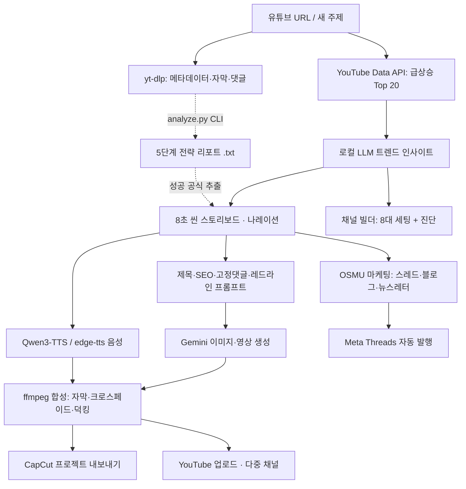

# 🎬 TubeInsight AI

<div align="center">


<p align="center">
  <strong>유튜브 트렌드 분석부터 채널 기획 · 8초 씬 대본 · 영상 합성 · 업로드 · 멀티채널 마케팅까지<br>
  전 과정을 로컬에서 처리하는 올인원 크리에이터 자동화 스튜디오</strong>
</p>

<p align="center">
  대본 · 기획 · 마케팅 생성이 로컬 LLM(LM Studio / Ollama)에서 돌아가므로 <strong>텍스트 생성에 API 비용이 들지 않습니다.</strong>
</p>

</div>

---

## 목차

- [무엇을 하는 도구인가](#무엇을-하는-도구인가)
- [6단계 파이프라인](#6단계-파이프라인)
- [아키텍처](#아키텍처)
- [빠른 시작](#빠른-시작)
- [외부 연동 설정](#외부-연동-설정)
- [API 개요](#api-개요)
- [프로젝트 구조](#프로젝트-구조)
- [보안](#보안)
- [알려진 제약](#알려진-제약)

---

## 무엇을 하는 도구인가

주제 하나를 넣으면 **기획 → 대본 → 음성 → 영상 → 업로드 → 홍보**로 이어지는 워크플로를 웹 대시보드 하나에서 처리합니다.

설계 원칙은 세 가지입니다.

- **로컬 우선** — 대본·기획·마케팅 텍스트 생성은 LM Studio 또는 Ollama에서 수행합니다. 외부 LLM API 키 없이 전체 흐름이 동작합니다.
- **8초 씬 단위** — 생성형 비디오 모델(Veo, Runway 등)의 클립 길이에 맞춰 모든 대본을 8초 단위로 설계합니다. 나레이션은 한국어 다큐 발화 속도(초당 5.2자) 기준 35~45자로 맞춥니다.
- **점진적 저하** — YouTube OAuth, Gemini, Threads 같은 외부 연동은 없으면 해당 기능만 비활성화되고 나머지는 정상 동작합니다.

---

## 6단계 파이프라인

웹 UI의 탭이 곧 워크플로 순서입니다.

### 1. 트렌드 & 영상 분석

- **실시간 인기 급상승 Top 20** 수집 (YouTube Data API v3, 카테고리·지역 지정)
- 수집된 트렌드를 로컬 LLM이 분석해 **훅 패턴 · 핵심 키워드 · 추천 소재** 리포트 생성
- **개별 영상 심층 수집** — `yt-dlp`로 메타데이터·챕터·자막·댓글을 수집하고 보관함에 저장
- 수집 데이터 CSV 내보내기, 저장된 리포트 다운로드
- **5단계 전략 리포트는 현재 CLI 전용입니다** — 웹 UI에는 생성 버튼이 없고 `analyze.py`로만 만들 수 있습니다.
  ```bash
  python3 analyze.py "https://youtu.be/영상ID"
  ```
  생성된 `data/<video_id>_리포트.txt`는 웹에서 조회·다운로드되고, 씬 기획의 성공 공식 추출에도 활용됩니다.
  목차는 제목·훅 구조 / 서사 전개 / 핵심 인사이트 / 댓글 여론 / 실행 전략 3가지입니다.

### 2. 채널 빌더 & 진단

- **핸들(@) 실시간 중복 검사**
- 주제·타깃·톤을 입력하면 **채널명, 설명란, 검색 키워드, 아바타/배너 이미지 프롬프트, 업로드 기본값**을 자동 기획
- 생성된 설명·키워드를 **YouTube API로 내 채널에 바로 반영**(`channels.update`)
- **채널 진단** — 구독자·조회수·영상 수를 바탕으로 성장 단계, 병목 지점, 개선 조언 산출

### 3. 씬 기획 & 나레이션

- 주제 하나로 **8초 단위 씬 스토리보드** 생성 — 씬별 타임스탬프, 서사 단계, 나레이션, 카메라 무빙, 조명, 현장 효과음(SFX), 영어 영상 프롬프트
- **길이 규격 검증** — 45자를 넘으면 경고를 표시합니다. 대본은 그대로 유지되며 다듬을지는 사용자가 판단합니다.
- **제목 후보 3종 · SEO 설명 · 인게이지먼트 질문 · 고정 댓글 초안** 동시 생성
- **첫 프레임 레드라인 JSON** — 썸네일/첫 프레임 이미지 생성용 규격화 프롬프트
- **음성 합성** — Qwen3-TTS(프리셋 성우 / Voice Clone / Voice Design) 및 edge-tts
- AutoFlow-Pro `.txt`, CSV, JSON 내보내기

### 4. 영상 제작 & 업로드

- `ffmpeg` 기반 합성 — 씬 이미지 + 나레이션 + 자막 번인, 씬 간 크로스페이드, 나레이션 구간 배경음 덕킹
- 진행률 추적(BackgroundTasks)
- **CapCut 프로젝트 내보내기** — 클립·오디오·자막을 타임라인에 자동 배치
- **YouTube 원클릭 업로드** — 재개 가능(resumable) 업로드, 썸네일 설정, 예약 공개, 댓글 등록
- **다중 채널 연결** — 브랜드 채널을 여러 개 연결해 두고 업로드할 채널을 골라 씁니다.

### 5. 멀티 마케팅 (OSMU)

원소스 멀티유즈. 주제/대본 하나로 3종 자산을 생성합니다.

- **Threads / X** — 바이럴 타래 5~10개 (훅 공식 + 본문 + 인터랙션 질문)
- **SEO 블로그** — H1/H2/H3 구조, FAQ, CTA를 갖춘 장문 마크다운 (네이버 / 티스토리 / 미디엄 / 일반 스타일 선택)
- **이메일 뉴스레터** — A/B 테스트용 제목 3종 + 반응형 HTML 템플릿
- **Meta Threads API 연동** — 생성한 타래를 순차 자동 발행

### 6. AI 음악 스튜디오 (Luna)

- Gemini Lyria로 장르·무드 기반 **완곡 생성**, 실패 시 `ffmpeg` 신디사이저로 폴백
- 앨범 아트 생성 및 음악 영상 렌더링
- 유튜브 업로드용 제목·설명·태그 자동 작성

---

## 아키텍처



**LLM 호출 경로** — 모든 텍스트 생성은 `llm_client.py`를 거칩니다. LM Studio(포트 1234)와 Ollama(포트 11434)를 자동 탐지하며, UI에서 백엔드와 모델을 직접 고를 수도 있습니다. JSON 응답이 필요한 경우 코드펜스 제거, 문자열 내 제어문자 이스케이프, 괄호 복구를 거쳐 파싱합니다.

---

## 빠른 시작

### 사전 요구사항

| 항목 | 필수 | 용도 |
|---|:---:|---|
| Python 3.11+ | ✅ | 런타임 |
| ffmpeg | ✅ | 영상 합성 · 오디오 변환 |
| **LM Studio** 또는 **Ollama** | ✅ | 대본·기획·마케팅 생성 |
| YouTube OAuth 클라이언트 | 선택 | 트렌드 수집, 채널 연동, 업로드 |
| Gemini API 키 | 선택 | 이미지·영상·음악 생성 |
| Meta Threads 토큰 | 선택 | 스레드 자동 발행 |

```bash
brew install ffmpeg
```

로컬 LLM은 둘 중 하나만 있으면 됩니다.

```bash
ollama run gemma4:latest
```

LM Studio를 쓰는 경우 앱에서 모델을 로드하고 **Local Server를 포트 1234로 시작**하세요.

### 설치 및 실행

```bash
git clone https://github.com/casareborgia/youtube-video-analysis.git
cd youtube-video-analysis

python3 -m venv .venv
source .venv/bin/activate
pip install -r requirements.txt

chmod +x run.sh
./run.sh
```

브라우저에서 **http://localhost:8765** 가 자동으로 열립니다.

> `run.sh`는 `.venv`가 없으면 만들어 주지만 최소 패키지만 설치합니다. 처음에는 위처럼 `pip install -r requirements.txt`를 직접 실행하세요.

---

## 외부 연동 설정

모든 설정은 웹 UI 우측 상단 **[API 키 & 시스템 환경설정]** 모달에서 확인·입력할 수 있습니다.

### YouTube Data API v3 (선택)

트렌드 수집, 채널 진단·브랜딩, 영상 업로드에 필요합니다.

1. [Google Cloud Console](https://console.cloud.google.com/)에서 프로젝트 생성
2. **YouTube Data API v3** 사용 설정
3. **사용자 인증 정보 → OAuth 클라이언트 ID → 애플리케이션 유형: 데스크톱 앱** 생성
4. 내려받은 JSON을 아래 경로에 저장

```
data/youtube/client_secret.json
```

5. 웹 UI에서 **[채널 추가 연결]** 클릭 → 브라우저에서 계정·채널 선택

토큰은 채널별로 `data/youtube/tokens/<channel_id>.json`에 저장됩니다. 브랜드 채널을 여러 개 연결해 두고 업로드 대상 채널을 전환할 수 있습니다.

> **동의 화면이 "테스트" 모드면 리프레시 토큰이 7일 뒤 만료됩니다.** 계속 쓰려면 게시 상태를 "프로덕션"으로 올리세요. 요청 스코프(`youtube.upload`, `youtube.readonly`, `youtube`, `youtube.force-ssl`)가 동의 화면에 등록되어 있어야 합니다.

### Gemini API 키 (선택)

이미지 생성, 영상 생성, Luna 음악 생성에 사용합니다. [Google AI Studio](https://aistudio.google.com/)에서 발급 후 설정 모달에 입력하면 `.env`에 저장됩니다.

### 환경 변수 (선택)

```bash
QWEN_TTS_DIR=/path/to/QWEN-tts          # Qwen3-TTS 설치 경로
QWEN_PYTHON=/path/to/QWEN-tts/.venv/bin/python
YOUTUBE_AUTH_TIMEOUT=180                 # OAuth 브라우저 인증 대기 상한(초)
GEMINI_API_KEY=...
```

---

## API 개요

FastAPI 라우트 **56개**. 전체 스펙은 서버 실행 후 http://localhost:8765/docs 에서 확인할 수 있습니다.

| 그룹 | 주요 엔드포인트 |
|---|---|
| 분석 | `POST /api/analyze` · `GET /api/metadata/{video_id}` · `GET /api/ai-report/{video_id}/download` · `GET /api/history` · `GET /api/export/csv` |
| 트렌드 | `GET /api/trends/top20` · `POST /api/trends/analyze` |
| 채널 | `GET /api/channel/check-handle` · `POST /api/channel/generate` · `GET /api/channel/my-status` · `POST /api/channel/apply-branding` |
| 씬 기획 | `GET /api/prompt/options` · `POST /api/prompt/generate-custom` · `POST /api/prompt/export` |
| 음성 | `GET /api/tts/voices` · `POST /api/tts/generate-scene` · `POST /api/tts/upload-voice` |
| 제작 | `POST /api/producer/build` · `GET /api/producer/status/{job_id}` · `POST /api/capcut/export` |
| 유튜브 | `GET /api/youtube/channels` · `POST /api/youtube/channels/select` · `GET /api/youtube/auth/login` · `POST /api/youtube/upload` |
| 마케팅 | `POST /api/marketing/generate` · `GET /api/marketing/history` |
| 스레드 | `GET /api/threads/status` · `POST /api/threads/publish` |
| 음악 | `POST /api/luna/generate` · `POST /api/luna/render` · `POST /api/luna/upload` |
| LLM | `GET /api/llm/status` · `GET /api/llm/models` · `POST /api/llm/select-model` |

---

## 프로젝트 구조

```
youtube-video-analysis/
├── app.py                  # FastAPI 서버 · 라우팅 · 보안 미들웨어
├── llm_client.py           # LM Studio / Ollama 통합 클라이언트, JSON 복원 파서
├── trend_scout.py          # 급상승 Top 20 수집 및 트렌드 분석
├── channel_builder.py      # 채널 8대 세팅 기획 · 핸들 검사 · 채널 진단
├── prompt_generator.py     # 8초 씬 스토리보드 · 나레이션 · 레드라인 프롬프트
├── tts_service.py          # Qwen3-TTS / Voice Clone 브릿지
├── qwen_tts_runner.py      # Qwen-TTS 격리 실행 러너
├── producer.py             # 이미지·영상 생성 및 ffmpeg 합성
├── capcut_builder.py       # 캡컷 프로젝트 자동 조립
├── uploader.py             # YouTube OAuth(다중 채널) · 업로드 · 브랜딩
├── marketing.py            # 스레드 · SEO 블로그 · 뉴스레터 생성
├── threads_client.py       # Meta Threads API 연동
├── luna_engine.py          # AI 음악 생성 · 앨범아트 · 뮤직비디오
├── analyze.py              # CLI 단독 분석 스크립트
├── run.sh                  # 원클릭 실행
├── data/                   # 수집 데이터 · 생성 산출물 (Git 제외)
│   ├── youtube/            # OAuth 자격증명 및 채널별 토큰
│   ├── audio/  voices/     # 합성 음성 · Voice Clone 참조
│   └── marketing/  luna_music/  renders/
└── static/                 # 대시보드 (index.html · app.js · style.css)
```

---

## 보안

로컬 실행 도구이지만 제로트러스트 원칙을 적용했습니다.

- **입력 검증** — 영상 ID·파일명 정규식 검증, 공식 유튜브 도메인만 허용(SSRF 방어)
- **경로 순회 방어** — 오디오 서빙·업로드에 `is_relative_to` 경계 검증
- **커맨드 인젝션 방어** — `os.system` 미사용, `subprocess.run` 인자 분리
- **보안 헤더** — CSP, `X-Content-Type-Options`, `X-Frame-Options`, `Referrer-Policy`
- **XSS 방어** — 프론트엔드 렌더링 시 `escapeHtml` 컨텍스트 이스케이프
- **프롬프트 인젝션 완화** — 사용자 주제 입력에서 지시문 탈취 패턴 정제
- **자격증명 분리** — `client_secret.json`, `token.json`, `.env` 모두 `.gitignore` 대상

서버는 `127.0.0.1`에만 바인딩되며 인증 기능이 없습니다. **외부에 노출하지 마세요.**

---

## 알려진 제약

정직하게 적어 둡니다.

- **SEO 블로그 생성이 약 20% 확률로 템플릿 폴백됩니다.** 로컬 모델이 장문 마크다운을 JSON에 담을 때 간헐적으로 복구 불가능한 형태로 깨집니다. 이 경우 응답에 `is_fallback: true`가 표시됩니다.
- **댓글 고정(pin)은 API로 불가능합니다.** YouTube Data API v3가 지원하지 않아 댓글 등록까지만 수행하며, 고정은 유튜브 스튜디오에서 직접 해야 합니다.
- **`blog_length` 파라미터는 동작하지 않습니다.** 생성 엔진에 길이 조절 인자가 없습니다. 대신 `blog_platform`으로 문체를 조절하세요.
- **`google-genai` 미설치 시** 이미지·영상·음악 생성이 비활성화됩니다. 나머지 기능은 정상 동작합니다.
- **영상 합성(producer) 파이프라인은 실사용 검증이 부족합니다.** 라우트와 의존성은 갖춰져 있으나 전 구간 실행 확인은 아직입니다.
- **`POST /api/analyze`의 `auto_generate_ai_report` 필드는 동작하지 않습니다.** 요청 스키마에 남아 있지만 참조하는 코드가 없습니다. 리포트는 `analyze.py`로 생성하세요.
- **긴 생성 작업은 1~3분이 걸립니다.** 8초 씬 4개 기준 약 2분, OSMU 통합 생성은 3분 이상 소요될 수 있습니다.
- **macOS 기준으로 개발되었습니다.** 폴더 열기(`open`), 시스템 TTS 폴백(`say`) 등 일부 기능은 macOS 전용입니다.

---

## 라이선스

MIT License
