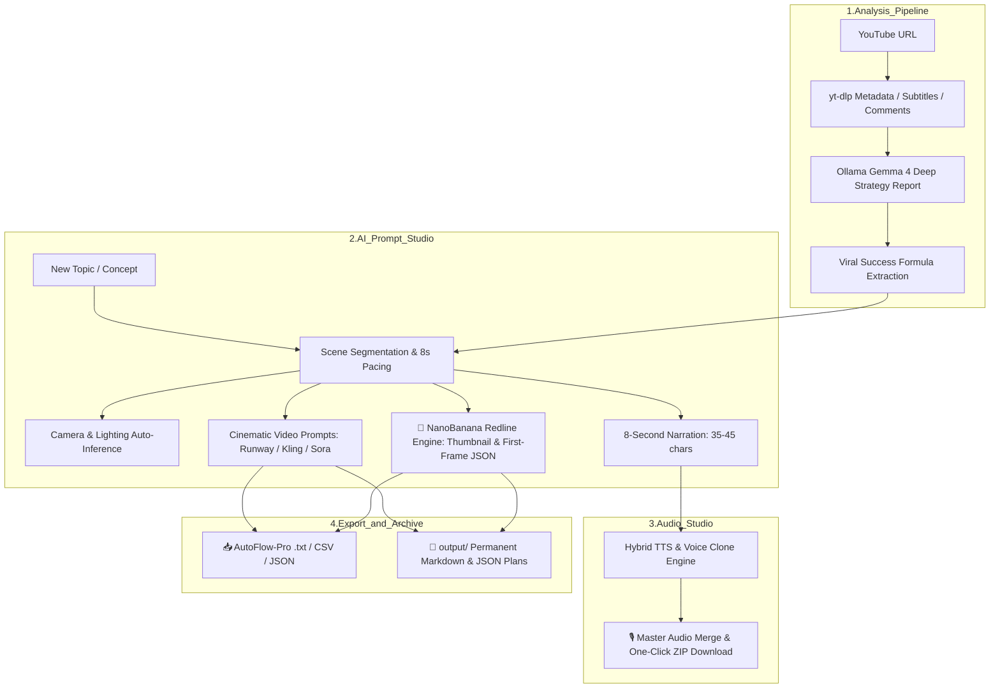

# 🎬 YouTube Video Analyzer & AI Prompt / Voice Studio

<div align="center">


<p align="center">
  <strong>[KO] 유튜브 흥행 영상의 심층 메타데이터와 연출 기법을 분석하고, 신규 주제의 기승전결 시네마틱 프롬프트·7개국어 대본·Qwen-TTS 음성(Voice Clone)을 원스톱으로 창작하는 멀티모달 AI 플랫폼입니다.</strong><br>
  <strong>[EN] A multimodal AI platform that analyzes YouTube viral videos to extract proven storytelling formulas, auto-generating cinematic storyboard prompts, 7-language scripts, and Qwen3-TTS narration with zero-shot voice cloning.</strong>
</p>

<p align="center">
  <a href="#-english"><strong>English</strong></a> •
  <a href="#-한국어-korean"><strong>한국어 (Korean)</strong></a>
</p>

</div>

---

# 🌐 English

## 🌟 Key Features

### 1. 🔍 Deep YouTube Video Analysis
- **High-Speed Ingestion with `yt-dlp`**: Extracts rich video metadata, chapter timelines, multilingual subtitles (KO/EN), and viewer comment sentiments in real-time.
- **Ollama Gemma 4 Strategic 5-Step Report**:
  1. *Title & Hook Structure*: Psychological triggers and opening retention mechanics.
  2. *Narrative Flow*: Progressive 4-stage storytelling mechanism (Hook → Exploration → Climax → Resolution).
  3. *Core Insights*: High-value takeaways and production essence.
  4. *Audience Reactions*: Key resonance factors from top comments.
  5. *Actionable Strategy*: 3 practical execution blueprints for creators.

### 2. 🎨 AI Cinematic & NanoBanana Redline Prompt Studio
- **Proven Success Formula Injection**: Automatically injects top viral formulas (5s opening hook, tension build-up, visual scale contrast, cinematic lighting) into new video prompts.
- **🔴 NanoBanana Redline Image Prompt Generator**:
  - **Full Redline Thumbnail (1x)**: Attention-grabbing hook text (<10 chars, in quotes), component callout labels, and verified dimension lines.
  - **Scene First-Frame Redline Prompts (Nx)**: Redline annotation graphics-focused prompts with max 1 text string to eliminate AI video text-morphing artifacts.
  - **Strict 6-Key JSON Schema**: Standardized schema across `format`, `style`, `scene`, `annotation_layer`, `text_layer`, and `constraints`.
  - **Aspect Ratio Optimization**: 16:9 Landscape (horizontal HUD flow) & 9:16 Shorts (vertical layout with top hook area and subtitle clearance).
- **⏱️ Strict 8-Second Narration Calibration**:
  - Dynamically enforces **35–45 characters (1–2 sentences)** per scene for a natural, calibrated 8-second speech pace (approx. 5.2 chars/sec).
  - Real-time character count and speech duration estimation with UI pacing indicators.
- **Target Generative AI Formats**:
  - 🎥 **Google Flow (Veo 2/3, Imagen 3/4)**: AutoFlow-Pro optimized descriptive prompts.
  - 🎨 **Midjourney v6.1**: Auto-appended parameters (`--ar 16:9 --v 6.1 --style raw`).
  - ⚡ **Runway Gen-3 / Kling AI / Luma / Sora**: Motion dynamics and physical interaction prompts.
- **📁 Output Documentation Archive**: Auto-saves complete production plans to `output/` in both Markdown (`.md`) and JSON (`.json`) formats.

### 3. 🌐 7-Language Script Generation
- 🇰🇷 **Korean** • 🇺🇸 **English** • 🇯🇵 **Japanese** • 🇨🇳 **Chinese** • 🇫🇷 **French** • 🇩🇪 **German** • 🇪🇸 **Spanish**
- Automatically writes culturally natural narration scripts for global content creators.

### 4. 🎙️ Hybrid TTS & Voice Clone Studio
- **Edge-TTS & Qwen3-TTS Integration**:
  - `Edge-TTS`: Ultra-fast free cloud presets (Injoon, Sunhi, Hyunsu).
  - `Qwen3-TTS (1.7B)`: Zero-shot voice cloning (`my_voice`) and expressive custom voices (*Ryan, Sohee, Uncle Fu, Vivian*).
- **Master Audio Merging & ZIP Bundle**: One-click parallel synthesis, concatenated master narration, and instant full-package ZIP download.

### 5. 📤 AutoFlow-Pro & Multi-Format Export
- **AutoFlow-Pro `.txt`**: One-click batch import format for AutoFlow-Pro.
- **Smart Task `.csv`**: Structured spreadsheet dataset with scene numbers, narrations, prompts, redline JSON, and camera angles.
- **Workflow `.json`**: Standard dataset for automated pipeline integrations.

### 6. 🛡️ Zero-Trust Security Hardened
- **Never Trust, Always Verify**: Strict SSRF verification (`verify_youtube_url`), video ID regex (`verify_video_id`), prompt injection sanitization (`sanitize_input_text`), and path containment checks (`is_relative_to`).
- **Security Headers Middleware**: Injected `Content-Security-Policy (CSP)`, `Permissions-Policy`, `X-Content-Type-Options: nosniff`, `X-Frame-Options: DENY`, and contextual `escapeHtml` sanitization.

---

## 🏗️ Architecture



---

## 🚀 Quick Start (English)

### 1. Prerequisites
- **Python 3.11+**
- **FFmpeg** (`brew install ffmpeg` or your OS package manager)
- **Ollama** ([https://ollama.ai](https://ollama.ai)) with Gemma 4 or LM Studio

### 2. Clone & Setup
```bash
git clone https://github.com/casareborgia/youtube-video-analysis.git
cd youtube-video-analysis

python3 -m venv .venv
source .venv/bin/activate
pip install -r requirements.txt
```

### 3. Run Server
```bash
chmod +x run.sh
./run.sh
```
Open **[http://localhost:8765](http://localhost:8765)** in your web browser.

---
---

# 🇰🇷 한국어 (Korean)

## 🌟 주요 핵심 기능

### 1. 🔍 유튜브 심층 분석 (YouTube Video & Metadata Analyzer)
- **yt-dlp 기반 고속 수집**: 영상 메타데이터, 챕터 타임라인, 자막(한국어/영어), 시청자 댓글 여론 실시간 수집
- **Ollama Gemma 4 심층 5단계 전략 리포트**:
  1. 제목·훅(Hook) 구조 분석
  2. 전개 방식 (단계별 서사 구조)
  3. 핵심 메시지 및 인사이트
  4. 댓글 여론 특징 및 시청자 반응
  5. 내 채널에 바로 적용할 3가지 실행 전략

### 2. 🎨 AI 프롬프트 스튜디오 & 나노바나나 레드라인 엔진
- **성공 공식 자동 주입**: 5초 오프닝 훅, 5단계 서사 플롯, 스케일 대비 연출, 시네마틱 조명 공식 자동 적용
- **🔴 나노바나나 레드라인(NanoBanana Redline) 이미지 프롬프트 생성기**:
  - **풀 레드라인 썸네일 (1건)**: 시선 강탈 훅 문구(10자 이내 큰따옴표), 주석 라벨, 실제 등장 수치 치수선
  - **씬별 첫 프레임 주석 프롬프트 (N건)**: 비디오 AI(Runway/Kling/Sora) 변환 시 글자 뭉개짐 방지를 위해 주석 그래픽 위주 및 텍스트 1개 이하로 제한
  - **6대 JSON 규격 준수**: `format`, `style`, `scene`, `annotation_layer`, `text_layer`, `constraints` 완벽 구조화
  - **화면비 최적화**: `16:9 (롱폼)` 가로 HUD 구도 vs `9:16 (쇼츠)` 세로 모바일 구도 (상단 훅, 하단 자막 여백)
- **⏱️ 8초 맞춤 대사(나레이션) 엄격 싱크 엔진**:
  - 한국어 다큐 발화 속도 기준 **공백 포함 35자~45자 (1~2문장)**로 대사 길이를 정밀 제한하여 8초 영상 클립과 1:1 싱크
  - UI 상에 글자 수 및 예상 발화 소요 시간 실시간 표시
- **📁 `output/` 기획서 자동 저장**: 생성 즉시 마크다운(`.md`) 및 JSON(`.json`) 문서로 영구 보관

### 3. 🌐 7개국 다국어 대본 창작 (Multilingual Script Generator)
- 🇰🇷 **한국어** • 🇺🇸 **English** • 🇯🇵 **日本語** • 🇨🇳 **中文** • 🇫🇷 **Français** • 🇩🇪 **Deutsch** • 🇪🇸 **Español**

### 4. 🎙️ 하이브리드 TTS & 음성 복제(Voice Clone) 스튜디오
- **Edge-TTS (무료 초고속)** 및 **Qwen-TTS (보이스 클론)** 통합
- **마스터 오디오 병합 & 원클릭 ZIP 다운로드**: 전체 씬 일괄 합성 후 통파일 마스터 오디오와 대본을 번들 다운로드

### 5. 📤 AutoFlow-Pro 및 멀티 포맷 내보내기 (Export)
- **AutoFlow-Pro `.txt`** • **스마트 태스크 `.csv`** • **워크플로우 `.json`**

### 6. 🛡️ 제로트러스트(Zero-Trust) 보안 체계
- **입력값 철저 검증**: SSRF 방어(`verify_youtube_url`), Video ID 정규식(`verify_video_id`), 프롬프트 인젝션 정제(`sanitize_input_text`), 경로 순회 방어(`is_relative_to`)
- **보안 헤더 미들웨어**: `Content-Security-Policy (CSP)`, `Permissions-Policy`, `X-Content-Type-Options: nosniff`, `X-Frame-Options: DENY`

---

## 📂 프로젝트 구조 (Directory Structure)

```
youtube-video-analysis/
├── app.py                  # FastAPI 메인 백엔드 서버 (제로트러스트 보안 미들웨어 탑재)
├── prompt_generator.py     # AI 시네마틱 & 나노바나나 레드라인 프롬프트 / 8초 대본 창작 엔진
├── tts_service.py          # 하이브리드 Edge-TTS & Qwen3-TTS 음성 합성 서비스
├── qwen_tts_runner.py      # Qwen-TTS 격리 실행 러너 스크립트
├── analyze.py              # 유튜브 메타데이터 및 리포트 독립 분석 모듈
├── requirements.txt        # Python 의존성 목록
├── run.sh                  # 원클릭 실행 쉘 스크립트
├── .gitignore              # 제로트러스트 데이터 제외 규칙
├── data/                   # 분석 데이터 및 합성 오디오 저장소 (Git 제외)
├── output/                 # 생성된 영상 기획서 마크다운 & JSON 저장소
└── static/                 # 글래스모피즘 다크 테마 웹 대시보드
    ├── index.html          # 메인 UI (분석기 & 프롬프트 스튜디오 & 레드라인 뷰어)
    ├── style.css           # 모던 HUD & 레드라인 테마 스타일시트
    └── app.js              # 프론트엔드 비동기 컨트롤러 & 오디오 제어
```

---

## 📜 라이선스 (License)
This project is licensed under the **MIT License**.
