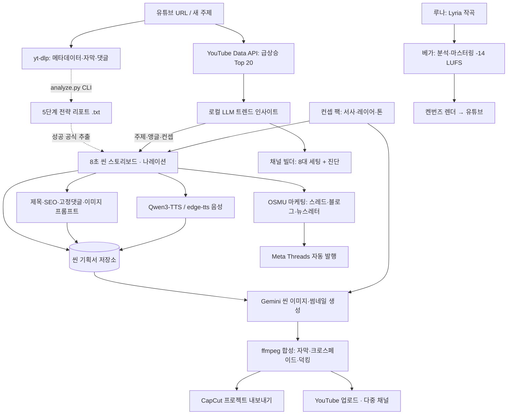

# 🎬 TubeInsight AI

<div align="center">


<p align="center">
  <strong>유튜브 트렌드 분석부터 채널 기획 · 8초 씬 대본 · 영상 합성 · 업로드 · 멀티채널 마케팅까지<br>
  전 과정을 로컬에서 처리하는 올인원 크리에이터 자동화 스튜디오</strong>
</p>

<p align="center">
  대본 · 기획 · 마케팅 생성이 로컬 LLM(LM Studio / Ollama)에서 돌아가므로 <strong>텍스트 생성에 API 비용이 들지 않습니다.</strong>
</p>

</div>

---

## 목차

- [무엇을 하는 도구인가](#무엇을-하는-도구인가)
- [7단계 파이프라인](#7단계-파이프라인)
- [아키텍처](#아키텍처)
- [빠른 시작](#빠른-시작)
- [외부 연동 설정](#외부-연동-설정)
- [API 개요](#api-개요)
- [프로젝트 구조](#프로젝트-구조)
- [보안](#보안)
- [알려진 제약](#알려진-제약)

---

## 무엇을 하는 도구인가

주제 하나를 넣으면 **기획 → 대본 → 음성 → 영상 → 업로드 → 홍보**로 이어지는 워크플로를 웹 대시보드 하나에서 처리합니다.

설계 원칙은 세 가지입니다.

- **로컬 우선** — 대본·기획·마케팅 텍스트 생성은 LM Studio 또는 Ollama에서 수행합니다. 외부 LLM API 키 없이 전체 흐름이 동작합니다.
- **8초 씬 단위** — 생성형 비디오 모델(Veo, Runway 등)의 클립 길이에 맞춰 모든 대본을 8초 단위로 설계합니다. 나레이션은 한국어 다큐 발화 속도(초당 5.2자) 기준 35~45자로 맞춥니다.
- **점진적 저하** — YouTube OAuth, Gemini, Threads 같은 외부 연동은 없으면 해당 기능만 비활성화되고 나머지는 정상 동작합니다.

---

## 7단계 파이프라인

웹 UI의 탭이 곧 워크플로 순서입니다.

### 1. 트렌드 & 영상 분석

- **실시간 인기 급상승 Top 20** 수집 (YouTube Data API v3, 카테고리·지역 지정)
- 수집된 트렌드를 로컬 LLM이 분석해 **훅 패턴 · 핵심 키워드 · 추천 소재** 리포트 생성
- 추천 주제마다 **차별화 앵글과 어울리는 컨셉 팩을 함께 제안**합니다. `[이 주제로 기획]` 을 누르면 주제·앵글·컨셉이 그대로 3단계로 넘어갑니다 (LLM 호출은 늘지 않습니다)
- **개별 영상 심층 수집** — `yt-dlp`로 메타데이터·챕터·자막·댓글을 수집하고 보관함에 저장
- 수집 데이터 CSV 내보내기, 저장된 리포트 다운로드
- **5단계 전략 리포트는 현재 CLI 전용입니다** — 웹 UI에는 생성 버튼이 없고 `analyze.py`로만 만들 수 있습니다.
  ```bash
  python3 analyze.py "https://youtu.be/영상ID"
  ```
  생성된 `data/<video_id>_리포트.txt`는 웹에서 조회·다운로드되고, 씬 기획의 성공 공식 추출에도 활용됩니다.
  목차는 제목·훅 구조 / 서사 전개 / 핵심 인사이트 / 댓글 여론 / 실행 전략 3가지입니다.

### 2. 채널 빌더 & 진단

- **핸들(@) 실시간 중복 검사**
- 주제·타깃·톤을 입력하면 **채널명, 설명란, 검색 키워드, 아바타/배너 이미지 프롬프트, 업로드 기본값**을 자동 기획
- 생성된 설명·키워드를 **YouTube API로 내 채널에 바로 반영**(`channels.update`)
- **채널 진단** — 구독자·조회수·영상 수를 바탕으로 성장 단계, 병목 지점, 개선 조언 산출

### 3. 씬 기획 & 나레이션

- **컨셉 팩 선택** — 서사 골격·이미지 레이어 구성·렌더 톤이 한 세트로 바뀝니다

  | 팩 | 서사 골격 | 이미지 |
  |---|---|---|
  | 레드라인 공학 다큐 *(기본)* | 도입 훅 → 갈등/스케일 → 공학적 난제 → 해결 → 여운 | 청록 디오라마 + 빨간 치수선·화살표 |
  | 인물·서사 중심 | 일상 → 균열 → 선택 → 대가 → 여운 | 자연광 인물 사진, 주석·글자 없음 |
  | 정보·지식 정리형 | 질문 → 통념 → 반전 근거 → 검증 → 결론 | 배경 정리된 에디토리얼, 라벨만 |
  | 리뷰·제품 검증형 | 기대 → 첫인상 → 한계 → 비교 → 판정 | 스튜디오 제품컷 + 최소 콜아웃 |

- 주제 하나로 **8초 단위 씬 스토리보드** 생성 — 씬별 타임스탬프, 서사 단계, 나레이션, 카메라 무빙, 조명, 현장 효과음(SFX), 영어 영상 프롬프트
- **길이 규격 검증** — 45자를 넘으면 경고를 표시합니다. 대본은 그대로 유지되며 다듬을지는 사용자가 판단합니다.
- **제목 후보 3종 · SEO 설명 · 인게이지먼트 질문 · 고정 댓글 초안** 동시 생성
- **첫 프레임 레드라인 JSON** — 썸네일/첫 프레임 이미지 생성용 규격화 프롬프트
- **음성 합성** — Qwen3-TTS(프리셋 성우 / Voice Clone / Voice Design) 및 edge-tts
- AutoFlow-Pro `.txt`, CSV, JSON 내보내기
- **[4단계 비디오 제작]** 버튼이 씬 기획서를 저장하고 영상 합성 탭으로 넘깁니다

### 4. 영상 제작 & 업로드

- **Gemini 씬 이미지 자동 생성** — 미디어가 없는 씬과 썸네일을 컨셉 팩의 스타일로 생성한 뒤 합성합니다. 진행률은 이미지 40% / 합성 60% 로 배분됩니다.
- `ffmpeg` 기반 합성 — 씬 이미지 + 나레이션 + 자막 번인, 씬 간 크로스페이드, 나레이션 구간 배경음 덕킹
- **나레이션 자동 싱크** — 대사가 8초를 넘으면 씬 길이를 늘려 맞춥니다
- 진행률 추적(BackgroundTasks), 완성 후 정지 구간 품질 검사
- **CapCut 프로젝트 내보내기** — 클립·오디오·자막을 타임라인에 자동 배치
- **YouTube 원클릭 업로드** — 재개 가능(resumable) 업로드, 썸네일 설정, 예약 공개, 댓글 등록
- **다중 채널 연결** — 브랜드 채널을 여러 개 연결해 두고 업로드할 채널을 골라 씁니다.

### 5. 멀티 마케팅 (OSMU)

원소스 멀티유즈. 주제/대본 하나로 3종 자산을 생성합니다.

- **Threads / X** — 바이럴 타래 5~10개 (훅 공식 + 본문 + 인터랙션 질문)
- **SEO 블로그** — H1/H2/H3 구조, FAQ, CTA를 갖춘 장문 마크다운 (네이버 / 티스토리 / 미디엄 / 일반 스타일 선택)
- **이메일 뉴스레터** — A/B 테스트용 제목 3종 + 반응형 HTML 템플릿
- **Meta Threads API 연동** — 생성한 타래를 순차 자동 발행

### 6. AI 음악 스튜디오 (Luna)

- **Gemini Lyria 3 Pro 완곡 생성** — 장르·무드 기반 완곡 작곡 (실패 시 `ffmpeg` 다중 하모닉스 신디사이저로 안전 폴백)
  - 모델 우선순위는 `lyria-3.5` → `lyria-3-pro-preview` → `lyria-3-clip-preview`. Lyria 3.5 의 입력 안전 필터는 같은 입력도 간헐적으로 거절하므로(확률적), `Input blocked` 응답이면 다음 모델로 내려가기 전에 같은 모델로 1회 재시도합니다 (`LYRIA_INPUT_BLOCK_RETRIES`, 기본 1 / `LYRIA_INPUT_BLOCK_RETRY_DELAY`, 기본 2초). 차단된 요청은 생성이 일어나지 않아 과금되지 않습니다
- **감성 가사(Lyrics) & 보컬 모드 지원** — 시티팝, R&B, 어쿠스틱 포크 등 장르별 보컬 친화도에 따른 자동 가사 기획 및 보컬 멜로디 스타일 주입 (수면/명상은 순수 연주곡 유지)
  - 생성된 가사 전문은 Lyria 작곡 입력에 그대로 전달되어 **음원의 노랫말과 설명란 가사가 일치**합니다 (연주곡은 가사를 보내지 않음). 실제로 보낸 입력은 트랙의 `lyria_input` 에, Lyria 가 보고한 텍스트는 `lyria_output_text` 에 남습니다
- **나노바나나(Imagen) 16:9 감성 앨범 아트** 생성 및 시네마틱 켄번즈 줌인 영상 렌더링
- **레오 ✕ 루나 알고리즘 패키징** — 유튜브 CTR 극대화 제목, `[Lyrics / 가사]` 전문이 포함된 감성 SEO 설명란, 시청자 반응 유도용 고정 댓글 자동 등록
  - 설명란의 가사는 LLM 이 옮겨 쓰지 않고 코드가 원문을 그대로 삽입합니다. 백업 신스 음원(보컬 없음)이면 가사 블록과 보컬 크레딧을 넣지 않으며, 레오 브리프로 작곡할 때 LLM 기획이 실패하면 브리프의 제목·테마를 유지한 템플릿으로 대체하고 UI 에 경고(`concept_source: fallback`)를 표시합니다
- **사운드 엔지니어 베가(Vega) 자동 마스터링** — 작곡 직후 음원을 분석(LUFS·트루피크·대역 밸런스·스테레오 폭)하고 장르 프리셋을 출발점으로 LLM이 EQ·컴프레서·새츄레이션·M/S·리미터 수치를 정해 유튜브 규격(-14 LUFS / -1 dBTP)으로 다듬습니다. 원본은 `audio_raw.*` 로 보존되어 A/B 비교(웹 미리듣기는 192k MP3, 렌더·업로드는 24bit WAV)와 프롬프트 재마스터링이 가능하며, LLM 실패 시 프리셋으로, 의존성 미설치 시 원본 그대로 진행합니다 (`VEGA_AUTO_MASTER=0` 으로 끌 수 있음)
- **레오 음악 스카우팅 비용 보호** — 루나 탭을 열 때 트렌드 스카우팅(YouTube Data API + Gemini)이 자동 실행되지 않고 서버에 저장된 마지막 브리프만 표시됩니다. 새 수집은 버튼을 눌렀을 때만 하며, 결과는 `data/trends/luna_music_briefs_<지역>.json` 에 저장되어 `LEO_MUSIC_BRIEF_TTL_HOURS`(기본 6시간) 안에서는 재사용됩니다

### 7. Threads ✕ X 통합 자동화

Threads와 X(Twitter)를 아우르는 소셜 오케스트레이션 대시보드입니다.

- **초안 검토 및 실시간 편집** — 5단계 마케팅 타래를 원클릭으로 소셜 초안으로 변환하거나 수동으로 단일/타래 글 작성 및 글자 수 검증
- **게시물 발행 오케스트레이터** — 단일/타래 글 즉시 또는 예약 발행, 멱등키 보장, 타래 부분 실패 방지, 드라이런 모의 검증
- **댓글 수집 및 AI 답글 자동화** — 내 게시물의 최신 댓글을 조회하고, 톤앤매너(친근/전문/재치)에 맞춘 AI 맞춤형 답글을 일괄 생성·승인·발행
- **스하리(팔로우·좋아요·리포스트) 자동화** — X 공식 API 및 전용 브라우저 폴백 기반 일일 한도(팔로우 10, 좋아요 25, 리포스트 10) 안전 보호
- **로컬 백그라운드 스케줄러** — SQLite 기반 원자적 분산 락/리스 점유, 지수 백오프 자동 재시도, 기한 지난 예약 작업 복구
- **계정 및 OAuth 2.0 PKCE 관리** — Threads 토큰 등록/해제, X OAuth 2.0 PKCE 인증 플로우(State/Verifier 검증) 및 토큰 자동 갱신
- **통합 실행 이력 및 감사 로그** — 플랫폼/상태별 필터링, 상세 실행 결과 및 에러 추적, XSS 방지 및 인증정보 유출 방지

---

## 아키텍처


```mermaid
graph TD
    A[유튜브 URL / 새 주제]

    A --> B[yt-dlp: 메타데이터·자막·댓글]
    A --> C[YouTube Data API: 급상승 Top 20]
    B -.->|analyze.py CLI| R[5단계 전략 리포트 .txt]
    C --> D[로컬 LLM 트렌드 인사이트]
    R -.->|성공 공식 추출| F

    D --> E[채널 빌더: 8대 세팅 + 진단]
    D -->|주제·앵글·컨셉| F[8초 씬 스토리보드 · 나레이션]
    CP[컨셉 팩: 서사·레이어·톤] --> F
    F --> G[제목·SEO·고정댓글·이미지 프롬프트]

    F --> H[Qwen3-TTS / edge-tts 음성]
    LY[루나: Lyria 작곡] --> VG[베가: 분석·마스터링 -14 LUFS]
    VG --> KB[켄번즈 렌더 → 유튜브]
    F --> S[(씬 기획서 저장소)]
    G --> S
    H --> S
    S --> I[Gemini 씬 이미지·썸네일 생성]
    CP --> I
    I --> J[ffmpeg 합성: 자막·크로스페이드·덕킹]
    J --> K[CapCut 프로젝트 내보내기]

    J --> L[YouTube 업로드 · 다중 채널]
    F --> M[OSMU 마케팅: 스레드·블로그·뉴스레터]
    M --> N[Meta Threads 자동 발행]
```

**LLM 호출 경로** — 모든 텍스트 생성은 `llm_client.py`를 거칩니다. LM Studio(포트 1234)와 Ollama(포트 11434)를 자동 탐지하며, UI에서 백엔드와 모델을 직접 고를 수도 있습니다. JSON 응답이 필요한 경우 코드펜스 제거, 문자열 내 제어문자 이스케이프, 괄호 복구를 거쳐 파싱합니다.

---

## 빠른 시작

### 사전 요구사항

| 항목 | 필수 | 용도 |
|---|:---:|---|
| Python 3.11+ | ✅ | 런타임 |
| ffmpeg (drawtext 지원) | ✅ | 영상 합성 · 자막 번인 |
| **LM Studio** 또는 **Ollama** | ✅ | 대본·기획·마케팅 생성 |
| YouTube OAuth 클라이언트 | 선택 | 트렌드 수집, 채널 연동, 업로드 |
| Gemini API 키 | 선택 | 이미지·영상·음악 생성 |
| Meta Threads 토큰 | 선택 | 스레드 자동 발행 |

```bash
# macOS
brew install ffmpeg

# Ubuntu / Debian
sudo apt update && sudo apt install -y ffmpeg
```

> **자막 번인에는 `drawtext` 필터가 필요합니다.** libfreetype 없이 빌드된 ffmpeg 는 이 필터가 없어 자막과 플레이스홀더 렌더가 실패합니다. 앱이 PATH 의 ffmpeg 를 검사해 `drawtext` 가 없으면 `requirements.txt` 에 포함된 **imageio-ffmpeg 번들 바이너리로 자동 대체**하므로 별도 조치 없이 동작합니다.

로컬 LLM은 둘 중 하나만 있으면 됩니다.

```bash
ollama run gemma4:latest
```

LM Studio를 쓰는 경우 앱에서 모델을 로드하고 **Local Server를 포트 1234로 시작**하세요.

### 설치 및 실행

```bash
# 1. 저장소 클론
git clone https://github.com/casareborgia/youtube-video-analysis.git
cd youtube-video-analysis

# 2. 환경변수 템플릿 복사 (선택: 웹 UI 설정 모달에서도 입력 가능)
cp .env.example .env

# 3. 가상환경 생성 및 의존성 전체 설치
python3 -m venv .venv
source .venv/bin/activate       # Windows(CMD): .venv\Scripts\activate
pip install --upgrade pip
pip install -r requirements.txt

# 4. 올인원 실행 스크립트 가동 (또는 uvicorn 직접 실행)
chmod +x run.sh
./run.sh
# 또는 직접 실행:
# python -m uvicorn app:app --host 127.0.0.1 --port 8765 --reload
```

브라우저에서 **http://localhost:8765** 가 자동으로 열립니다.

> `run.sh`를 실행하면 가상환경(.venv) 존재 여부 및 `.env` 파일 유무를 자동 감지하여 누락된 의존성을 안전하게 자동 초기화합니다.

---

## 외부 연동 설정

모든 설정은 웹 UI 우측 상단 **[API 키 & 시스템 환경설정]** 모달에서 확인·입력할 수 있습니다.

### YouTube Data API v3 (선택)

트렌드 수집, 채널 진단·브랜딩, 영상 업로드에 필요합니다.

1. [Google Cloud Console](https://console.cloud.google.com/)에서 프로젝트 생성
2. **YouTube Data API v3** 사용 설정
3. **사용자 인증 정보 → OAuth 클라이언트 ID → 애플리케이션 유형: 데스크톱 앱** 생성
4. 내려받은 JSON을 아래 경로에 저장

```
data/youtube/client_secret.json
```

5. 웹 UI에서 **[채널 추가 연결]** 클릭 → 브라우저에서 계정·채널 선택

토큰은 채널별로 `data/youtube/tokens/<channel_id>.json`에 저장됩니다. 브랜드 채널을 여러 개 연결해 두고 업로드 대상 채널을 전환할 수 있습니다.

> **동의 화면이 "테스트" 모드면 리프레시 토큰이 7일 뒤 만료됩니다.** 계속 쓰려면 게시 상태를 "프로덕션"으로 올리세요. 요청 스코프(`youtube.upload`, `youtube.readonly`, `youtube`, `youtube.force-ssl`)가 동의 화면에 등록되어 있어야 합니다.

### Gemini API 키 (선택)

이미지 생성, 영상 생성, Luna 음악 생성에 사용합니다. [Google AI Studio](https://aistudio.google.com/)에서 발급 후 설정 모달에 입력하면 `.env`에 저장됩니다.

### 환경 변수 (선택)

```bash
QWEN_TTS_DIR=/path/to/QWEN-tts          # Qwen3-TTS 설치 경로
QWEN_PYTHON=/path/to/QWEN-tts/.venv/bin/python
YOUTUBE_AUTH_TIMEOUT=180                 # OAuth 브라우저 인증 대기 상한(초)
GEMINI_API_KEY=...
```

---

### Threads/X 소셜 통합 연동 설정

#### 1. Threads 계정 설정
- Meta Threads 토큰은 웹 UI 대시보드의 **[7. Threads ✕ X 통합 자동화 → 6. 계정/연결 설정]** 탭 또는 설정 모달에서 토큰 및 User ID를 등록할 수 있습니다.
- 환경변수로 설정 시:
  ```bash
  THREADS_USER_ID=...
  THREADS_ACCESS_TOKEN=...
  ```

#### 2. X (Twitter) OAuth 2.0 PKCE 인증 설정
- **X Developer Portal**에서 프로젝트/앱을 생성하고 OAuth 2.0 User Authentication Settings를 활성화합니다.
  - Type of App: **Web App** 또는 **Single page App**
  - Callback URI / Redirect URL: `http://localhost:8765/api/x/auth/callback` (또는 포트 8000)
  - Scopes: `tweet.read`, `tweet.write`, `users.read`, `like.write`, `follows.write`, `offline.access`
- `.env`에 클라이언트 정보를 등록하거나 UI에서 직접 연결을 시작합니다:
  ```bash
  X_CLIENT_ID=...
  X_CLIENT_SECRET=...
  X_REDIRECT_URI=http://localhost:8765/api/x/auth/callback
  # 또는 기존 정적 User Access Token 직접 입력 가능:
  # X_USER_ACCESS_TOKEN=...
  # X_USER_ID=...
  ```
- 웹 UI에서 **[X OAuth 2.0 연결 시작]** 버튼을 클릭하면 브라우저 인가 창이 열리며, 승인 완료 시 액세스/리프레시 토큰이 안전하게 저장(`data/x_config.json`, Git 제외)됩니다.

#### 3. 웹 브라우저 폴백 (전용 Playwright 프로필)
- Threads의 팔로우·좋아요 등 공식 API 미지원 기능은 로컬 Playwright 브라우저로 폴백 동작합니다. 최초 1회 브라우저를 설치하고 전용 프로필에서 로그인합니다:
  ```bash
  uv run playwright install chromium
  uv run python engagement_automation.py login
  ```
- 프로필 경로는 `data/social_browser_profile/`이며 `.gitignore`에 의해 보호됩니다.

#### 4. 드라이런·승인·예약 운영 규칙
- **모든 쓰기 작업 기본 드라이런**: 게시물 발행, 댓글 답글, 스하리 참여 모두 `dry_run=true`가 기본값입니다.
- **2단계 승인 가드**: 실제 외부 SNS 전송(`confirm_live=true`) 시 웹 UI에서 대상 플랫폼, 계정, 작업 개수가 명시된 확인 대화상자(`socialConfirmModal`)의 확인을 거쳐야만 요청이 전달됩니다.
- **예약 실행 및 지수 백오프**: `social_jobs` 테이블에 `scheduled` 상태로 저장되며, 로컬 백그라운드 스케줄러가 원자적 리스 점유(`locked_by`, `locked_at`)를 통해 중복 실행을 차단하고 실패 시 3회까지 지수 백오프로 재시도합니다.

---

## API 개요

FastAPI 라우트 **80개 이상**. 전체 스펙은 서버 실행 후 http://localhost:8765/docs 에서 대화형 Swagger로 확인할 수 있습니다.

| 그룹 | 주요 엔드포인트 |
|---|---|
| 분석 | `POST /api/analyze` · `GET /api/metadata/{video_id}` · `GET /api/ai-report/{video_id}/download` · `GET /api/history` · `GET /api/export/csv` |
| 트렌드 | `GET /api/trends/top20` · `POST /api/trends/analyze` |
| 채널 | `GET /api/channel/check-handle` · `POST /api/channel/generate` · `GET /api/channel/my-status` · `POST /api/channel/apply-branding` |
| 씬 기획 | `GET /api/prompt/concepts` · `GET /api/prompt/options` · `POST /api/prompt/generate-custom` · `POST /api/prompt/export` |
| 씬 기획서 | `POST /api/scenes/save` · `GET /api/scenes/list` · `GET\|DELETE /api/scenes/{plan_id}` |
| 음성 | `GET /api/tts/voices` · `POST /api/tts/generate-scene` · `POST /api/tts/upload-voice` |
| 제작 | `POST /api/producer/build` · `POST /api/producer/images` · `GET /api/producer/status/{job_id}` · `POST /api/capcut/export` |
| 유튜브 | `GET /api/youtube/channels` · `POST /api/youtube/channels/select` · `GET /api/youtube/auth/login` · `POST /api/youtube/upload` |
| 마케팅 | `POST /api/marketing/generate` · `GET /api/marketing/history` |
| 소셜 계정/인증 | `GET /api/social/accounts` · `GET /api/x/auth/login` · `GET /api/x/auth/callback` · `POST /api/x/auth/disconnect` |
| 소셜 초안/발행 | `POST /api/social/drafts/from-marketing` · `POST /api/social/drafts/manual` · `PUT /api/social/drafts/{job_id}/items/{idx}` · `POST /api/social/publish/{job_id}` |
| 소셜 댓글/답글 | `GET /api/social/comments/{platform}/{post_id}` · `POST /api/social/replies/batch-preview` · `POST /api/social/replies/batch-execute` |
| 소셜 스하리 | `GET /api/social/capabilities` · `POST /api/social/engagement/run` · `GET /api/engagement/discover` · `POST /api/engagement/auto-run` |
| Threads 성장 캠페인 | `POST /api/growth/campaigns/start` · `POST /api/growth/campaigns/end` · `GET /api/growth/campaigns/{id}/summary` · `GET /api/growth/campaigns/{id}/compare` · `POST /api/growth/insights/snapshot` · `POST /api/growth/draft-reply` |
| 소셜 대기열/예약 | `GET /api/social/jobs` · `POST /api/social/jobs/{job_id}/schedule` · `POST /api/social/jobs/{job_id}/cancel` · `POST /api/social/jobs/{job_id}/retry` · `GET /api/social/scheduler/status` · `POST /api/social/scheduler/tick` |
| 소셜 통합 이력 | `GET /api/social/history` |
| 음악 | `POST /api/luna/generate` · `POST /api/luna/master` · `GET /api/vega/status` · `POST /api/luna/render` · `POST /api/luna/upload` |
| LLM | `GET /api/llm/status` · `GET /api/llm/models` · `POST /api/llm/select-model` |

---

## 프로젝트 구조

```
youtube-video-analysis/
├── app.py                  # FastAPI 서버 · 라우팅 · 보안 미들웨어
├── llm_client.py           # LM Studio / Ollama 통합 클라이언트, JSON 복원 파서
├── trend_scout.py          # 급상승 Top 20 수집 및 트렌드 분석
├── channel_builder.py      # 채널 8대 세팅 기획 · 핸들 검사 · 채널 진단
├── concept_packs.py        # 컨셉 팩 — 서사 골격 · 이미지 레이어 · 렌더 톤 · 텍스트 정책
├── prompt_generator.py     # 8초 씬 스토리보드 · 나레이션 · 이미지 프롬프트
├── scene_store.py          # 씬 기획서 저장소 (3단계 → 4단계 전달)
├── tts_service.py          # Qwen3-TTS / Voice Clone 브릿지
├── qwen_tts_runner.py      # Qwen-TTS 격리 실행 러너
├── producer.py             # 이미지·영상 생성 및 ffmpeg 합성
├── capcut_builder.py       # 캡컷 프로젝트 자동 조립
├── uploader.py             # YouTube OAuth(다중 채널) · 업로드 · 브랜딩
├── marketing.py            # 스레드 · SEO 블로그 · 뉴스레터 생성
├── threads_client.py       # Meta Threads API 연동
├── engagement_automation.py # Threads/X 팔로우·좋아요·리포스트 자동화
├── luna_engine.py          # AI 음악 생성 · 앨범아트 · 뮤직비디오
├── vega_engine.py          # 사운드 엔지니어 베가 — 루나 음원 마스터링 (분석·LLM/프리셋 결정·DSP·24bit WAV)
├── analyze.py              # CLI 단독 분석 스크립트
├── run.sh                  # 원클릭 실행
├── data/                   # 수집 데이터 · 생성 산출물 (Git 제외)
│   ├── youtube/            # OAuth 자격증명 및 채널별 토큰
│   ├── scene_plans/        # 씬 기획서 (영상 합성 입력)
│   ├── renders/            # 생성 이미지 · 합성 결과 mp4
│   ├── audio/  voices/     # 합성 음성 · Voice Clone 참조
│   └── marketing/  luna_music/  renders/
└── static/                 # 대시보드 (index.html · app.js · style.css)
```

---

## 보안

로컬 실행 도구이지만 제로트러스트 원칙을 적용했습니다.

- **입력 검증** — 영상 ID·파일명 정규식 검증, 공식 유튜브 도메인만 허용(SSRF 방어)
- **경로 순회 방어** — 오디오 서빙·업로드에 `is_relative_to` 경계 검증
- **커맨드 인젝션 방어** — `os.system` 미사용, `subprocess.run` 인자 분리
- **보안 헤더** — CSP, `X-Content-Type-Options`, `X-Frame-Options`, `Referrer-Policy`
- **XSS 방어** — 프론트엔드 렌더링 시 `escapeHtml` 컨텍스트 이스케이프
- **프롬프트 인젝션 완화** — 사용자 주제 입력에서 지시문 탈취 패턴 정제
- **자격증명 분리** — `client_secret.json`, `token.json`, `.env` 모두 `.gitignore` 대상

서버는 `127.0.0.1`에만 바인딩되며 인증 기능이 없습니다. **외부에 노출하지 마세요.**

---

## 알려진 제약

정직하게 적어 둡니다.

- **LLM 응답 파싱에 실패하면 템플릿으로 대체됩니다.** 씬 대본·마케팅 모두 이 경우 응답에 `is_fallback: true` 가 실리고 화면에 경고가 뜹니다. **경고 없이 나온 결과만 실제 생성물입니다.** 씬 개수를 줄이거나 다시 생성하면 대개 해결됩니다.
- **SEO 블로그 생성이 간헐적으로 폴백됩니다.** 로컬 모델이 장문 마크다운을 JSON 에 담을 때 복구 불가능한 형태로 깨지는 경우가 있습니다(관측 약 20%).
- **댓글 고정(pin)은 API로 불가능합니다.** YouTube Data API v3가 지원하지 않아 댓글 등록까지만 수행하며, 고정은 유튜브 스튜디오에서 직접 해야 합니다.
- **`blog_length` 파라미터는 동작하지 않습니다.** 생성 엔진에 길이 조절 인자가 없습니다. 대신 `blog_platform`으로 문체를 조절하세요.
- **`POST /api/analyze`의 `auto_generate_ai_report` 필드는 동작하지 않습니다.** 요청 스키마에 남아 있지만 참조하는 코드가 없습니다. 리포트는 `analyze.py`로 생성하세요.
- **`google-genai` 없이도 앱은 뜨지만** 이미지·영상·음악 생성이 비활성화됩니다. `requirements.txt` 에 포함돼 있습니다.
- **베가 마스터링은 lofi 실제 곡 1곡으로 검증했습니다.** ffmpeg EBU R128 독립 측정으로 -11.6 → -14.0 LUFS, 트루피크 +0.3 → -2.0 dBTP(렌더 영상도 -14.0 LUFS)를 확인했고 재마스터 지시도 반영됩니다. 다른 9개 장르는 합성 신호 테스트까지만 했습니다. 재마스터 후에는 영상이 구버전이 되므로 패널 경고를 보고 다시 렌더해야 합니다. 샘플레이트는 원본(Lyria 44.1kHz)을 유지합니다. `pedalboard` 미설치 시 마스터링만 건너뜁니다.
- **컨셉 팩의 내부 이름은 아직 레드라인 기준입니다.** `generate_redline_image_prompts()`, `first_frame_redline` 등 함수·필드명이 그대로라, 인물 컨셉 결과도 `redline` 이 붙은 키에 담깁니다. 동작에는 영향이 없습니다.
- **`info_breakdown` · `product_review` 팩은 프롬프트 구조까지만 확인했습니다.** 실제 이미지 생성으로 눈으로 검증한 것은 레드라인과 인물·서사 두 팩입니다.
- **실제 유튜브 업로드는 미검증입니다.** 인자 불일치는 해소했고 다중 채널 연결은 동작하지만, 진짜 영상을 올려본 적은 없습니다.
- **Threads 좋아요·팔로우는 웹 UI 폴백입니다.** Threads 공식 API가 해당 동작을 제공하지 않아 플랫폼 UI 변경이나 로그인 만료 시 수동 확인이 필요할 수 있습니다.
- **생성 시간** — 씬 6개 약 2분, 10~12개 약 3분, 이미지 생성 포함 합성은 씬당 20~40초가 추가됩니다. OSMU 통합 마케팅은 3분 이상.
- **macOS 기준으로 개발되었습니다.** 폴더 열기(`open`), 시스템 TTS 폴백(`say`) 등 일부 기능은 macOS 전용입니다.

---

## 라이선스

MIT License
