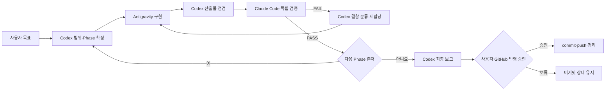

# Threads/X 통합 자동화 작업지시서

## 1. 문서 정보

| 항목 | 내용 |
|---|---|
| 작업명 | TubeInsight Threads/X 통합 자동화 |
| 목표 수준 | 현재 PC에서 운용 중인 Aside 방식의 게시·댓글 자동화를 프로젝트 내부 기능으로 구현 |
| 프로젝트 | `유튜브 영상분석실습` |
| 기준 브랜치 | `feat/social-engagement-automation` |
| 오케스트레이터 | Codex |
| 구현 워커 | Antigravity |
| 독립 검증 | Claude Code |
| 현재 상태 | 일부 기능과 스하리 초안 존재, 통합 자동화 미완성 |

이 문서는 Threads/X 자동화 전체 범위의 단일 작업 기준서다. 스하리는 전체 기능 중 하나이며, 게시물 발행과 댓글·답글 자동화가 동일한 우선순위의 핵심 범위다.

## 2. 최종 목표

TubeInsight에서 생성하거나 사용자가 직접 작성한 콘텐츠를 Threads와 X에 게시하고, 댓글·답글을 관리하며, 선택한 대상에 팔로우·좋아요·리포스트를 실행할 수 있는 로컬 통합 자동화 시스템을 구축한다.

최종 사용 흐름은 다음과 같다.

1. Threads/X 계정을 연결하고 연결 상태를 확인한다.
2. 유튜브 분석 결과나 직접 입력한 주제로 플랫폼별 게시물을 생성한다.
3. 초안을 검토하고 즉시 또는 예약 발행한다.
4. 단일 게시물이나 연속 타래를 발행한다.
5. 특정 게시물에 댓글·답글을 작성하거나, 내 게시물에 달린 댓글을 검토해 답글을 생성한다.
6. 승인된 대상에 스하리 동작을 실행한다.
7. 모든 작업의 상태, 결과, 실패 원인, 재시도 이력을 대시보드에서 확인한다.

## 3. 전체 기능 범위

### 3.1 계정과 인증

- Threads OAuth 연결, 상태 확인, 토큰 갱신, 연결 해제
- X OAuth 2.0 사용자 인증, 상태 확인, 토큰 갱신, 연결 해제
- 플랫폼별 사용자 ID, 사용자명, 권한 범위 확인
- 토큰·쿠키·브라우저 프로필의 로컬 보관과 Git 제외
- 권한 부족, 만료, 재로그인 필요 상태의 명확한 표시

### 3.2 콘텐츠 생성과 편집

- 유튜브 분석 결과, 영상 대본, 직접 입력 주제를 소스로 사용
- Threads와 X 각각의 글자 수·말투·해시태그 규칙 적용
- 단일 게시물과 2~10개 연속 타래 생성
- 게시 전 개별 문장 편집, 순서 변경, 삭제
- 댓글·답글 초안 생성
- 답글 톤 선택: 친근함, 정보형, 감사형, 질문형, 간결형
- 생성 결과 저장과 재불러오기

### 3.3 게시물 발행

- Threads 단일 텍스트 게시물 발행
- Threads 연속 타래 발행
- X 단일 텍스트 게시물 발행
- X 연속 타래 발행
- 플랫폼별 이미지 1장 첨부 발행
- 드라이런과 실제 발행 분리
- 즉시 발행과 예약 발행
- 부분 실패 시 성공한 게시물과 실패한 게시물을 분리 기록
- 동일 요청의 중복 발행 방지

### 3.4 댓글·답글 자동화

- Threads 게시물 ID 또는 URL을 대상으로 답글 발행
- X 게시물 ID 또는 URL을 대상으로 답글 발행
- 내 게시물에 달린 최근 댓글·답글 목록 조회
- 선택한 댓글에 AI 답글 초안 생성
- 사용자가 승인한 답글만 실제 발행
- 여러 댓글을 처리할 때 대상별 개별 승인 또는 승인된 배치 실행
- 동일 댓글에 중복 답글 방지
- 내가 작성한 답글과 원댓글의 연결 이력 저장
- 삭제, 숨김, 신고 자동화는 이번 필수 범위에서 제외

### 3.5 스하리·참여 자동화

- 대상 계정 팔로우
- 대상 게시물 좋아요
- 대상 게시물 리포스트
- Threads 공식 API 미지원 동작의 전용 Playwright 웹 방식
- X 공식 API 우선 실행과 선택적 웹 방식
- 이미 수행된 동작을 다시 눌러 취소하지 않도록 상태 확인
- 플랫폼·계정·게시물·동작 단위 중복 방지
- 일일 전체 및 동작별 실행 한도

### 3.6 예약·작업 대기열·재시도

- 게시, 답글, 스하리를 공통 작업 모델로 저장
- `draft`, `approved`, `scheduled`, `running`, `succeeded`, `partial`, `failed`, `cancelled` 상태 관리
- 예약 시각과 로컬 시간대 저장
- 앱 재시작 후에도 예약 작업 유지
- 네트워크 오류와 일시적 API 오류만 제한적으로 재시도
- 인증 오류, 입력 오류, 권한 오류는 자동 재시도하지 않음
- 재시도 횟수와 마지막 오류 기록
- 예약 취소와 실패 작업 수동 재실행

### 3.7 통합 대시보드와 이력

- 계정 연결 상태 카드
- 콘텐츠 생성·편집 영역
- 플랫폼별 게시·답글·스하리 실행 패널
- 예약 작업과 최근 실행 목록
- 성공, 부분 성공, 실패, 차단 상태 필터
- 게시물 URL과 원댓글 URL 바로가기
- 작업 상세에서 요청값, 결과 ID, 시각, 실패 원인 확인
- 토큰·쿠키·민감정보는 화면과 로그에 표시하지 않음

## 4. 현재 구현과 격차

Antigravity는 아래 표를 기준으로 기존 코드를 보존하고 부족한 부분을 구현한다.

| 기능 | 현재 상태 | 작업 지시 |
|---|---|---|
| Threads OAuth·상태·연결 해제 | 구현됨 | 오류 처리와 권한 범위 점검 |
| Threads 단일·연속 타래 발행 | 구현됨 | 공통 작업 모델과 드라이런·중복 방지 연결 |
| Threads/X 콘텐츠 생성 | 구현됨 | 플랫폼 값과 글자 수 검증, 편집 흐름 연결 |
| X OAuth·계정 상태 | 미구현 | 공식 OAuth 사용자 인증과 상태 API 구현 |
| X 단일·연속 타래 발행 | 미구현 | 공식 API 클라이언트와 UI 구현 |
| Threads 답글 발행 | 저수준 `reply_to_id`만 존재 | 독립 답글 API와 이력 구현 |
| X 답글 발행 | 미구현 | 공식 API 기반 구현 |
| Threads/X 댓글 목록 조회 | 미구현 | 권한 범위 내 최근 댓글 조회 구현 |
| AI 댓글·답글 생성 | 미구현 | 콘텐츠 맥락과 톤을 이용한 초안 생성 |
| 승인된 댓글 배치 실행 | 미구현 | 승인 상태, 중복 방지, 실행 한도 구현 |
| 스하리 | 구현 초안 존재 | 전체 작업 모델에 통합하고 보완 |
| 예약 작업·지속 대기열 | 미구현 | SQLite 기반 스케줄러와 재시도 구현 |
| 통합 실행 이력 | 스하리 이력만 존재 | 게시·답글·스하리 공통 이력으로 확장 |
| 통합 대시보드 | 일부 UI 존재 | 전체 워크플로를 한 화면에서 연결 |
| 테스트 | 스하리 단위 테스트만 존재 | 게시·답글·예약·API 계약 테스트 확장 |

기준 파일은 `marketing.py`, `threads_client.py`, `engagement_automation.py`, `app.py`, `static/index.html`, `static/app.js`, `README.md`, `requirements.txt`, `.env.example`, `.gitignore`, `tests/`다.

## 5. 역할과 권한

### 5.1 Codex — 오케스트레이터

- 이 작업지시서와 사용자 요구사항을 최종 기준으로 관리한다.
- 단계별 범위와 인수 조건을 Antigravity에 전달한다.
- Antigravity의 변경사항을 점검한 뒤 Claude Code 검증 단계로 넘긴다.
- Claude Code가 발견한 결함을 심각도와 영향에 따라 Antigravity에 재할당한다.
- 기존 작업과 충돌하거나 범위가 달라지면 사용자의 판단을 받는다.
- 외부 계정 라이브 테스트 범위를 사용자에게 구체적으로 제시하고 별도 승인을 받는다.
- 사용자 승인 전 commit, push, merge를 실행하지 않는다.

### 5.2 Antigravity — 구현 워커

- 작업 시작 전 브랜치와 Git 상태를 확인하고 기록한다.
- 현재 미커밋 변경을 보존하며 관련 구현을 이어서 완성한다.
- 단계별로 작동 가능한 작은 단위로 구현하고 테스트한다.
- 기존 공개 API를 깨지 않으며 필요한 경우 호환 라우트를 유지한다.
- 구현 후 변경 파일, 테스트 결과, 미해결 제한사항을 Codex에 보고한다.
- 실제 SNS 동작, commit, push, merge는 임의로 실행하지 않는다.

### 5.3 Claude Code — 독립 검증자

- 구현 설명을 그대로 신뢰하지 않고 코드와 실행 결과를 독립 검증한다.
- 검증 단계에서는 소스 코드를 임의 수정하지 않는다.
- 발견 사항을 `P0`, `P1`, `P2`, `P3`로 구분해 파일과 라인을 제시한다.
- 실제 외부 계정 동작 없이 단위·통합·계약·정적 검사를 실행한다.
- 미해결 `P0` 또는 `P1`이 있으면 `FAIL`을 반환한다.

## 6. 구현 아키텍처 원칙

### 6.1 공통 도메인 모델

게시·답글·스하리를 별도 임시 로직으로 늘리지 말고 공통 작업 모델로 관리한다.

필수 필드:

- `job_id`
- `platform`: `threads` 또는 `x`
- `job_type`: `publish`, `reply`, `engagement`
- `status`
- `dry_run`
- `scheduled_at`
- `approved_at`
- `started_at`, `finished_at`
- 대상 계정·게시물·댓글 식별자
- 입력 콘텐츠와 첨부 미디어 참조
- 시도 횟수와 마지막 오류 코드
- 플랫폼 응답 ID와 게시물 URL
- 생성 시각과 수정 시각

### 6.2 플랫폼 어댑터

서비스 계층이 플랫폼별 HTTP 세부사항에 직접 의존하지 않도록 아래 공통 인터페이스를 둔다.

- `get_account_status()`
- `publish_post()`
- `publish_thread()`
- `list_replies()`
- `reply_to_post()`
- `follow_account()`
- `like_post()`
- `repost()`

Threads와 X 어댑터는 동일한 결과 형식을 반환하고, API 미지원 기능은 명시적인 상태 코드로 보고한다.

### 6.3 공식 API 우선

- 공식 API가 제공하는 기능은 공식 API를 사용한다.
- 웹 자동화는 공식 API로 처리할 수 없는 기능에만 적용한다.
- Playwright는 전용 영속 프로필을 사용한다.
- UI 선택자가 바뀌면 안전하게 실패해야 하며 다른 버튼을 추측해 누르지 않는다.
- CAPTCHA, 보호 장치, 로그인 보안 절차를 우회하지 않는다.

### 6.4 기존 API 호환

기존 `/api/threads/*`, `/api/marketing/*`, `/api/engagement/*` 호출은 바로 제거하지 않는다. 통합 `/api/social/*` 계층을 추가하더라도 기존 UI가 동작하도록 호환 래퍼나 단계적 마이그레이션을 적용한다.

## 7. Antigravity 단계별 작업 지시

### Phase 0 — 기준선 감사

1. `git status --short --branch`와 `git branch --show-current`를 기록한다.
2. 현재 수정 파일과 신규 파일을 읽고 삭제·초기화하지 않는다.
3. 위 격차표를 실제 코드와 대조해 `충족`, `부분 충족`, `미충족`으로 보고한다.
4. 구현 순서와 수정 예정 파일을 Codex에 제출한다.

완료 조건: Codex가 범위와 수정 파일을 확인한다.

### Phase 1 — 공통 저장소와 작업 상태

- SQLite 스키마에 계정 상태, 작업, 작업 항목, 실행 시도, 중복 키를 정의한다.
- 기존 스하리 이력을 안전하게 유지하거나 마이그레이션한다.
- 작업 생성, 승인, 예약, 실행, 취소, 재시도 전이를 검증한다.
- 앱 재시작 후 예약·실패 상태가 유지되어야 한다.
- 동시 실행 시 동일 중복 키와 일일 한도가 우회되지 않게 트랜잭션을 적용한다.

완료 조건: 외부 API 없는 저장소 단위 테스트 통과.

### Phase 2 — 계정 연결

- 기존 Threads OAuth를 공통 계정 상태에 연결한다.
- X OAuth 사용자 인증 흐름과 콜백을 구현한다.
- 필요한 권한 범위를 문서화하고 연결 상태 API에 반환한다.
- 토큰 만료와 권한 부족을 별도 오류 코드로 반환한다.
- `.env`와 로컬 설정 파일의 비밀정보를 로그에 출력하지 않는다.

완료 조건: 모의 OAuth 응답을 이용한 상태·오류 테스트 통과.

### Phase 3 — 콘텐츠 생성·검토

- 기존 `marketing.generate_threads_x()` 결과를 통합 초안 모델로 변환한다.
- 플랫폼 값은 `threads`, `x`로 표준화하고 기존 `twitter` 값은 호환 처리한다.
- 플랫폼별 길이 제한과 빈 콘텐츠를 서버에서 검증한다.
- 단일 게시물과 타래를 편집 가능한 초안으로 저장한다.
- 댓글·답글 초안 생성 함수를 추가하되 원문·게시물 맥락·선택 톤을 입력으로 사용한다.

완료 조건: 생성 결과가 발행 요청으로 손실 없이 변환되는 테스트 통과.

### Phase 4 — Threads/X 게시 발행

- Threads 기존 단일·타래 발행을 통합 서비스에 연결한다.
- X 단일 게시물과 연속 타래 발행을 공식 API로 구현한다.
- 두 플랫폼 모두 드라이런, 즉시 실행, 예약 실행을 지원한다.
- 타래 중간 실패 시 성공 항목과 실패 항목을 기록하고 무조건 처음부터 재발행하지 않는다.
- 동일 승인 요청의 중복 발행을 막는다.
- 이미지 첨부는 플랫폼별 업로드 후 게시물 발행 단계로 처리한다.

완료 조건: 가짜 플랫폼 어댑터로 단일·타래·부분 실패·중복 테스트 통과.

### Phase 5 — 댓글·답글 자동화

- Threads와 X에 대상 게시물 답글 발행 기능을 구현한다.
- 내 게시물의 최근 댓글·답글을 읽는 기능을 권한 범위 내에서 구현한다.
- 댓글 목록에서 답글 초안을 생성하고 사용자가 수정·승인할 수 있게 한다.
- 승인되지 않은 답글은 실행하지 않는다.
- 배치 실행은 승인된 항목만 대상으로 하며 대상·내용·예상 동작 수를 실행 전에 표시한다.
- 원댓글 ID와 내 답글 ID를 저장해 중복 답글을 방지한다.
- 댓글 조회 권한이 없는 경우 웹 자동화로 무조건 대체하지 말고 `unsupported` 또는 `permission_required`로 보고한다.

완료 조건: 승인 누락 차단, 중복 방지, 부분 실패, 권한 오류 테스트 통과.

### Phase 6 — 스하리 통합

- 기존 `engagement_automation.py`를 공통 작업·이력 모델에 연결한다.
- Threads 공식 API 리포스트와 웹 팔로우·좋아요를 구분한다.
- X는 공식 API를 우선하고 필요할 때만 사용자가 웹 방식을 선택하게 한다.
- 이미 완료된 팔로우·좋아요·리포스트 상태를 확인해 취소 동작을 방지한다.
- 한 요청 최대 10개 대상, 일일 전체 30회, 팔로우 10회, 좋아요 25회, 리포스트 10회를 기본값으로 유지한다.

완료 조건: 기존 스하리 테스트와 공통 이력 통합 테스트 통과.

### Phase 7 — 예약 실행기와 재시도

- 별도 클라우드 서비스 없이 앱 프로세스에서 동작하는 로컬 예약 실행기를 구현한다.
- 서버 시작 시 실행되지 못한 예약 작업을 다시 로드한다.
- 동일 작업을 동시에 두 번 잡지 않도록 원자적 점유를 구현한다.
- 일시적 네트워크·서버 오류에만 지수 백오프와 최대 재시도를 적용한다.
- 앱 종료 중인 시각에 지난 예약은 정책에 따라 `대기 후 실행` 또는 `사용자 확인 필요`로 표시한다.

완료 조건: 가상 시계 또는 주입 가능한 시간으로 예약·재시도 테스트 통과.

### Phase 8 — 통합 대시보드

- Threads/X 자동화 전용 영역에 계정, 초안, 발행, 댓글, 스하리, 예약, 이력 탭을 제공한다.
- 실제 실행 버튼은 드라이런 결과가 있고 사용자가 대상을 확인한 뒤 활성화한다.
- 실제 실행 직전에 플랫폼, 계정, 작업 종류, 항목 수를 확인 대화상자에 표시한다.
- 실패한 항목은 성공 항목과 분리해 재시도할 수 있게 한다.
- 서버 응답 문자열은 HTML 출력 전에 이스케이프한다.
- 모바일 폭에서도 입력과 실행 버튼이 겹치지 않게 한다.

완료 조건: 정적 문법 검사와 주요 사용자 흐름의 브라우저 검증 통과.

### Phase 9 — 문서와 운영 준비

- README에 플랫폼별 설정, OAuth 권한, Playwright 설치·로그인, 실행 방법을 기록한다.
- 드라이런, 승인, 예약, 실패 재시도, 연결 해제 절차를 설명한다.
- `.env.example`에는 변수 이름만 두고 실제 값은 넣지 않는다.
- 토큰 파일, SQLite 런타임 파일, 브라우저 프로필을 `.gitignore`에 포함한다.
- 실제 계정 스모크 테스트는 별도 승인 전까지 실행하지 않는다.

완료 조건: 문서 명령이 현재 프로젝트 구조와 일치하고 비밀정보 검사가 통과한다.

## 8. 필수 API 계약

구체적인 URL은 기존 라우트와 충돌하지 않는 범위에서 조정할 수 있으나 다음 기능 계약을 제공해야 한다.

| 기능 | 권장 API |
|---|---|
| 전체 기능·한도 조회 | `GET /api/social/capabilities` |
| 연결 계정 상태 | `GET /api/social/accounts` |
| X OAuth 시작·콜백·해제 | `/api/x/auth/*` |
| 초안 생성·저장·수정 | `/api/social/drafts/*` |
| 게시 드라이런·실행 | `POST /api/social/publish` |
| 댓글 목록 | `GET /api/social/replies` |
| 답글 초안 생성 | `POST /api/social/replies/generate` |
| 답글 드라이런·실행 | `POST /api/social/replies/run` |
| 스하리 드라이런·실행 | `POST /api/engagement/run` 또는 호환 통합 경로 |
| 예약·대기열 목록 | `GET /api/social/jobs` |
| 예약 생성·취소·재시도 | `/api/social/jobs/*` |
| 통합 이력 | `GET /api/social/history` |

모든 쓰기 API는 기본 드라이런 또는 초안 상태를 사용한다. 실제 외부 동작에는 서버가 검증하는 명시적 승인 필드가 필요하다.

## 9. 안전·품질 요구사항

- 플랫폼과 URL 도메인이 일치해야 한다.
- 계정·게시물·댓글 식별자 형식을 검증한다.
- 브라우저 자동화는 허용된 Threads/X HTTPS URL만 연다.
- 외부 API 오류 전문에 토큰이나 쿠키가 포함돼도 로그·응답·DB에 저장하지 않는다.
- 작업 내용과 대상에서 중복 키를 생성해 재요청에 안전하게 대응한다.
- 발행·답글·스하리 한도는 서버에서 적용한다.
- 댓글 자동 생성 내용은 실행 전 사용자가 검토할 수 있어야 한다.
- 실제 동작은 UI 확인만 믿지 않고 서버에서도 승인 필드를 확인한다.
- 테스트는 실제 플랫폼 클라이언트를 모킹하고 외부 호출을 금지한다.

금지 사항:

- 기존 미커밋 변경 삭제 또는 강제 초기화
- 인증정보 커밋
- CAPTCHA·보안 확인 우회
- 불특정 다수 자동 탐색과 무차별 상호작용
- 승인 없는 라이브 게시·답글·스하리
- 테스트 삭제나 안전 한도 제거로 검증 통과

## 10. Antigravity 보고 형식

각 Phase 완료 시 다음 형식으로 Codex에 보고한다.

```text
[Antigravity Phase N 구현 보고]
- 시작 브랜치와 Git 상태:
- 이번 Phase 목표:
- 수정한 파일:
- 구현 내용:
- 데이터 마이그레이션 영향:
- 실행한 테스트와 결과:
- 실제 외부 계정 동작 실행 여부: 아니요
- 남은 문제와 다음 Phase 선행조건:
- 상태: READY_FOR_REVIEW / BLOCKED
```

## 11. Claude Code 독립 검증

### 11.1 공통 검사

```bash
git status --short --branch
git diff --check
.venv/bin/python -m unittest discover -s tests -v
.venv/bin/python -m py_compile app.py threads_client.py engagement_automation.py tests/*.py
node --check static/app.js
git check-ignore -v .env data/social_engagement.db data/social_browser_profile/session
git ls-files .env 'data/*.db*' 'data/social_browser_profile/**'
```

### 11.2 기능 검증 행렬

| 영역 | 필수 검증 |
|---|---|
| 계정 | 연결, 만료, 권한 부족, 연결 해제 |
| 콘텐츠 | 플랫폼별 길이, 빈 값, 편집 보존 |
| 게시 | 단일, 타래, 드라이런, 중복, 부분 실패 |
| 댓글 | 조회, 초안, 승인 누락 차단, 중복 답글, 부분 실패 |
| 스하리 | 동작별 실행, 이미 완료 상태, 일일 한도, 잘못된 URL |
| 예약 | 재시작 복구, 중복 점유, 취소, 제한 재시도 |
| 보안 | 토큰 비노출, SSRF 방지, HTML 이스케이프, Git 제외 |
| UI | 드라이런→확인→실행 흐름, 결과·오류 표시 |

### 11.3 코드 리뷰 중점

- 공식 API 요청 형식과 필요한 사용자 권한이 올바른가
- Threads/X 어댑터가 공통 서비스와 분리돼 있는가
- 타래 부분 실패가 중복 게시로 이어지지 않는가
- 댓글 승인 상태를 API 요청자가 임의로 우회할 수 없는가
- SQLite 트랜잭션이 동시 실행과 일일 한도를 보호하는가
- 예약 실행기가 서버 재시작 후 중복 실행하지 않는가
- 실패 응답과 DB detail에 인증정보가 남지 않는가
- Playwright 선택자가 다른 계정이나 다른 게시물의 버튼을 누를 가능성이 없는가

### 11.4 검증 보고 형식

```text
[Claude Code 독립 검증 보고]
- 검증 대상 작업 트리/커밋:
- 검증한 Phase:
- 실행 명령과 결과:
- 통과 항목:
- 발견 사항:
  - [P0/P1/P2/P3] 제목 — 파일:라인
    - 재현 절차:
    - 영향:
    - 권장 수정:
- 실제 외부 계정 동작 실행 여부: 아니요
- 최종 판정: PASS / FAIL / CONDITIONAL PASS
```

## 12. 오케스트레이션 흐름



상태는 `PLANNED → IN_PROGRESS → READY_FOR_REVIEW → READY_FOR_VALIDATION → VALIDATING → REWORK → VERIFIED → APPROVED_TO_PUBLISH` 순서로 기록한다.

## 13. 최종 인수 조건

- [ ] 기존 Threads 게시 기능과 미커밋 변경이 보존됐다.
- [ ] Threads/X 계정 연결 상태를 대시보드에서 확인할 수 있다.
- [ ] Threads/X 단일 게시물과 연속 타래를 드라이런 후 발행할 수 있다.
- [ ] Threads/X 대상 게시물에 승인된 답글을 발행할 수 있다.
- [ ] 내 게시물의 최근 댓글을 조회하고 답글 초안을 만들 수 있다.
- [ ] 승인되지 않은 댓글·답글은 실제 실행되지 않는다.
- [ ] 팔로우·좋아요·리포스트가 공통 이력과 한도에 연결됐다.
- [ ] 즉시·예약 작업이 공통 대기열에서 상태 전이된다.
- [ ] 앱 재시작 후 예약 작업과 이력이 유지된다.
- [ ] 중복 게시, 중복 답글, 중복 스하리가 차단된다.
- [ ] 부분 실패 결과와 재시도 대상이 구분된다.
- [ ] 인증정보와 브라우저 프로필이 Git과 화면에 노출되지 않는다.
- [ ] 단위·통합·API 계약·JavaScript 문법 검사가 통과한다.
- [ ] Claude Code 검증에 미해결 `P0`·`P1`이 없다.
- [ ] 남은 `P2`·`P3`를 Codex가 사용자에게 보고했다.
- [ ] 사용자 승인 전 라이브 테스트, commit, push, merge가 실행되지 않았다.

## 14. 범위 밖 항목

- 불특정 다수 계정의 자동 수집과 무차별 댓글·팔로우
- CAPTCHA 또는 플랫폼 보호 장치 우회
- 계정 생성과 로그인 정보 수집
- 삭제·숨김·신고 자동화
- 광고 캠페인 집행과 결제
- 클라우드 배포와 24시간 무중단 운영
- 성과 분석에 기반한 자율 타깃 발굴

이 항목들은 통합 자동화 안정화 후 별도 작업지시서와 사용자 승인으로 진행한다.

## 15. 최종 게이트

모든 Phase에서 Antigravity 구현 보고와 Claude Code 검증 `PASS`를 받은 뒤 Codex가 전체 변경사항과 남은 제한사항을 사용자에게 보고한다. 실제 계정 스모크 테스트와 GitHub 반영은 각각 구체적인 실행 범위를 제시하고 사용자에게 별도 승인을 받은 후 진행한다.
